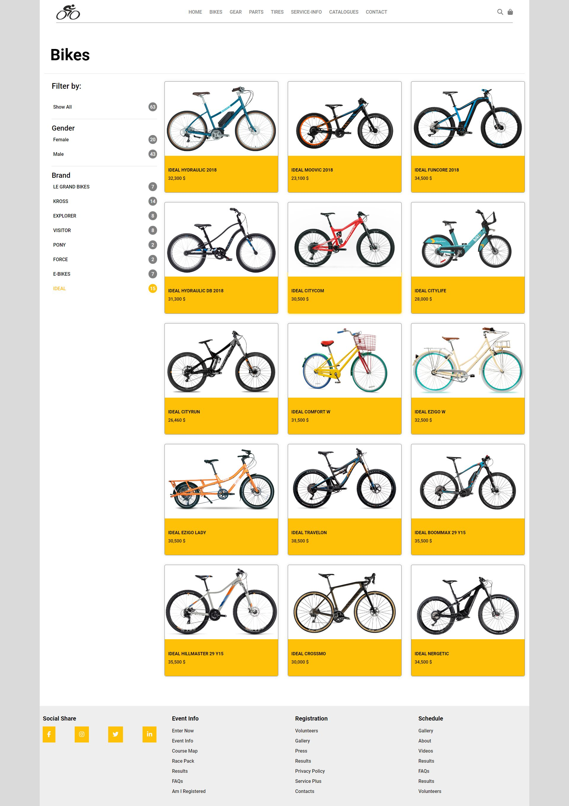

# Bikes products page

## About

Bikes Products Page is a React-based product page designed for showcasing bikes-products. It features multiple filters to help users easily find the products they are looking for. This project demonstrates the use of React for building dynamic and interactive web applications and it is part of the weekly challenges from [Brainster](https://brainster.co/ "Brainster") Front-End Academy.

## Features

- Responsive Header
  - Logo
  - Navigation with links
  - Action icons for cart and search
- Filter for Products
  - Show All
  - Filter by gender
  - Filter by Brand
- Products list
  - List of filtered products cards with displayed image, name and price
- Responsive Footer
  - Social icons
  - Links

## Demo

To see live preview of the project [Click Here](https://jakimoski.github.io/products-filter/ "Bikes products ")

## Screenshot



## Tech Stack

- **[REACT ](https://react.dev/ "React")**
- **[ SASS](https://sass-lang.com/ "SASS")**

## Run Locally

Clone the project

```bash
  git clone hhttps://github.com/jakimoski/products-filter.git
```

Go to the project directory

```bash
  cd my-project
```

Install dependencies

```bash
  npm install
```

Start the server

```bash
  npm run start
```

Build

```bash
  npm run build
```

## Pages

### ProductsCategory

ProductsCategory page is the main parent of **FilterComponent** responsible for filtering the products and **MainCardComponent** where all filtered products are shown.

## Main Components

### Header

---

The Header component is made from three components Logo, Nav and HeaderAction component. All items positioning is controlled with flex.

#### HeaderLogoComponent

- This component controls the logo of the website in the header

#### HeaderNavComponent

- This component controls the main navigation in the header

#### HeaderActionComponent

- This component controls the search and cart action items in the header

### MainCardComponent

---

-This component is where all product cards are shown, it receives the products as a prop with ProductsList type and renders the products using SingleCardComponent.

```javascript
type ProductsList = {
  products: ProductType[],
};
```

- **SingleCardComponent** is a component for every single product where the image, name and price are shown that are sent as props from MainCardComponent.

```javascript
type ProductType = {
  name: string,
  price: number,
  gender: string,
  brand: string,
  image: string,
};
```

### FilterComponent

---

- The Filter Component is responsible for filtering the products based on category and gender. The component receives props from the main parent with FilterPropsType.

```javascript
type FilterPropsType = {
  updateProducts(prev: ProductType[]): void,
  productsList: ProductType[],
};
```

- **FilterOptionComponent** is the component for single option for the filer options. It receives props from FilterOptionProps type.

```javascript
type FilterOptionProps = {
  category: string,
  isActive: string,
  filterProducts: (event: any) => void,
  filerItemsLength: (name: string) => number,
};
```

### Footer

---

FooterComponent is the main component for the footer of the website and it is parent of FooterGroupComponent, FooterLinkComponent and FooterSocialComponent.

#### FooterGroupComponent

- This component is a parent group of a list of links that are shown in the FooterComponent.

#### FooterLinkComponent

- This component controls the single link in the FooterGroupComponent.

#### FooterSocialComponent

- This component controls social icons.
